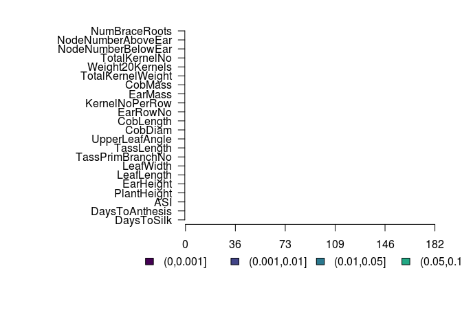
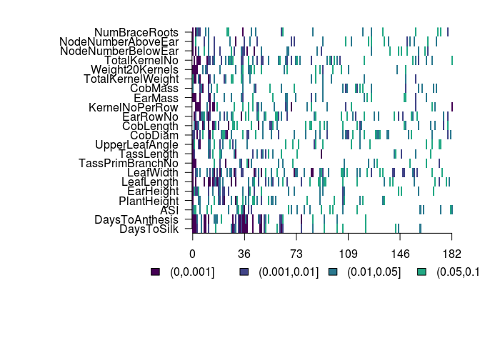
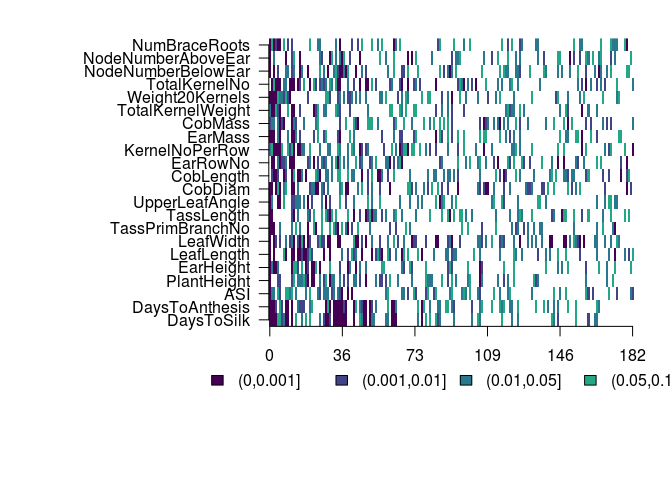

This notebook has code for running a form of Q<sub>xpc</sub> analysis using the Major-Goodman GWAS panel and detecting selection in the Ames panel.

First, load in the kinship matrix and make a conditional matrix

```r
load('data/ames.281E.K.rda')

sigma11 = as.matrix(myF[1:2704,1:2704])
sigma12 = as.matrix(myF[1:2704,2705:2984])
sigma21 = as.matrix(myF[2705:2984,1:2704])
sigma22 = as.matrix(myF[2705:2984,2705:2984]) #we are dropping the last row
sigma.cond = sigma11 - sigma12 %*% solve(sigma22) %*% sigma21 
```


```r
### This code makes a bunch of secondary sets of eigenvalues and saves them.
regEig = eigen(myF)
#write.table(regEig$vectors,file='data/ames.reg.eigenvectors', quote=F, row.names=F, col.names=F)
#write.table(regEig$values,file='data/ames.reg.eigenvalues', quote=F, row.names=F, col.names=F)
save(regEig, file = 'data/ames.281E.regeig.rda')

condEig = eigen(sigma.cond)
save(condEig, file = 'data/ames.281E.condeig.rda')

load('data/amesOnly.E.K.rda')
amesEig = eigen(amesOnly)
save(amesEig, file='data/amesOnly.eig.rda')
```


```r
##read in the eigen data for the conditional amtrix
load('data/ames.281E.condeig.rda')
cEigVectors = condEig$vectors
cEigValues = condEig$values

#read in trait names
traitNames = read.table('data/blup.names', stringsAsFactors=F)$V1
```


```r
#get cutoffs for pcs based on % variation explained
varexp = cEigValues/sum(cEigValues)
sumexp = sapply(1:length(varexp), function(x){sum(varexp[1:x])})
par(mfrow=c(1,2), mar=c(5,5,1,1))

#get cutoffs for how many pcs to look at
pcmax = which(sumexp > 0.3)[1]

#remove the last end of PCs 
tailCutoff = round(.9*length(cEigValues))
```


# Run Qpc on the Ames Panel

The function is in qpctools/R/QpcAmes.R

```bash
cat qpctools/R/QpcAmes.R
```

```
## #' Calculate Qpc on Ames panel
## #'
## #' This function calculates Qpc the Ames panel (referred to as the genotyping panel).
## #' @param myI the trait number that we're looking at
## #' @param myM the number of lines in the genotyping panel
## #' @param gwasPrefix path prefix for the GWAS results
## #' @param sigPrefix path prefix for the genotypes of GWAS loci in the genotyping panel
## #' @param cutoff p value cutoff for including SNPs. Default is 1.
## #' @param mysigma the kinship matrix for the combined genotyping and GWAS panels.
## #' @param myLambda a list of eigenvalues of the conditional kinship matrix
## #' @param myU a matrix of eigenvectors of the conditional kinship matrix
## #' @export
## 
## 
## Qpcames <- function(myI, myM = 2704, gwasPrefix = 'data/281-gwas-results/ldfiltered.', sigPrefix='data/281-gwas-results/sigSnps.',
##                     mysigma=myF, mypcmax = pcmax, myLambda = cEigValues, myU = cEigVectors){
## 
## #calculate matrices
## sigma22 = as.matrix(mysigma[(myM + 1):dim(mysigma)[1], (myM + 1):dim(mysigma)[1]])
## sigma12 = as.matrix(myF[1:myM, (myM + 1):dim(mysigma)[1]])
## tailCutoff = round(myM*0.9)
## 
## #read in data
## gwasHits = read.table(paste(gwasPrefix,myI,sep=""), stringsAsFactors=F)
## names(gwasHits) = c('x','y',strsplit('chr     rs      ps      n_miss  allele1 allele0 af      beta    se      l_remle l_mle   p_wald  p_lrt   p_score', split=' +')[[1]])
## sigGenos = read.table(paste(sigPrefix,myI, sep=""), header=T, stringsAsFactors=F)
## 
## #combine table of GWAS results with genotypes in the GWAS set
## combData = dplyr::left_join(sigGenos, gwasHits, by = c('locus'='rs'))
## myBetas = as.matrix(combData$beta)
## myG = t(as.matrix(sigGenos[,4:ncol(sigGenos)]))
## 
## #center genotype matrix
## m = nrow(myG)
## myT = matrix(data = -1/m, nrow = m - 1, ncol = m)
## diag(myT) = (m - 1)/m
## myGcent = myT %*% myG
## 
## #calculate breeding values
## allZ = myGcent %*% myBetas
## z1 = allZ[1:myM]
## z2 = allZ[(myM+1):length(allZ)]
## zcond = mean(allZ) + sigma12 %*% solve(sigma22) %*%  z2 #calculating the conditional prediction for Z (j)
## 
## #project breeding values onto PCs and standardize
## myBm = t(z1 - zcond) %*% as.matrix(myU) #z1 - zcond is the observed - expected under conditional
## 
## myCmprime = sapply(1:(myM-1), function(x){t(myBm[,x]/sqrt(myLambda[x]))})
## myQm = sapply(1:mypcmax, function(n){
##     var0(myCmprime[n])/var0(myCmprime[(tailCutoff-50):tailCutoff])
##   })
## myPsprime = sapply(1:mypcmax, function(x){pf(myQm[x], 1, 50, lower.tail=F)})
## 
## outList = list(muprime = zcond, cmprime = myCmprime, pprime = myPsprime)
## #return the data in a reasonable way
## }
```


```r
qpcamesOut = lapply(traitNames,Qpcames)
save(qpcamesOut, file='data/qpc-ames-output.rda')
```

# Look at results

```r
load('data/qpc-ames-output.rda')

niceTraitnames = sapply(traitNames, function(x){
  strsplit(x, '0607')[[1]][1]
})

pcpvals = sapply(qpcamesOut, function(x) {x$pprime}) #matrix, rows are pvals, columns are traits
allqvals = get_q_values(pcpvals)

## TODO FIX AXES
layout(matrix(1, nrow=1, ncol=1))
mysig2 =  cut((1:1000/1000), c(0,0.001,0.01,0.05,0.1,1)) #for legend
par(mar=c(8,14,2,2), xpd=TRUE, mfrow=c(1,1))
mycol = c(viridis(6, direction=1)[1:4], "white")
image(allqvals, col=mycol, xaxt="n", yaxt="n", bty="n", breaks=c(0,0.001,0.01,0.05,0.1,1))
#axis(1, at = c(0:5/5), labels = (0:5)*10)
axis(1, at = c(0,0.2,0.4,0.6,0.8,1), labels=round(c(0,0.2,0.4,0.6,0.8,1)*nrow(allqvals)))
axis(2, at=(0:21)/21, labels = niceTraitnames, las=2)
legend(-0.2,-0.15, levels(mysig2), fill=mycol, bty="n", horiz=T)
```

<!-- -->

```r
#mysig = apply(allqvals, 2, function(x){ cut(x, c(0,0.001,0.01,0.05,0.1,1), labels=F)})
image(pcpvals, col=mycol, xaxt="n", yaxt="n", bty="n", breaks=c(0,0.001,0.01,0.05,0.1,1))
#axis(1, at = c(0:5/5), labels = (0:5)*10)
axis(1, at = c(0,0.2,0.4,0.6,0.8,1), labels=round(c(0,0.2,0.4,0.6,0.8,1)*nrow(allqvals)))
axis(2, at=(0:21)/21, labels = niceTraitnames, las=2)
legend(-0.2,-0.15, levels(mysig2), fill=mycol, bty="n", horiz=T)
```

<!-- -->


# Running the original version of the test.

The function is in qpctools/R/QpcAmes-nocond.R

```bash
cat qpctools/R/QpcAmes-nocond.R
```

```
## #' Calculate Qpc on Ames panel
## #'
## #' This function calculates Qpc on Ames panel.
## #' @param myI the trait number that we're looking at
## #' @param myM the number of lines in the genotyping panel
## #' @param gwasPrefix path prefix for the GWAS results
## #' @param sigPrefix path prefix for the genotypes of GWAS loci in the genotyping panel
## #' @param cutoff p value cutoff for including SNPs. Default is 1.
## #' @param mysigma the kinship matrix for the genotyping panel.
## #' @param myLambda a list of eigenvalues of the genotyping panel kinship matrix
## #' @param myU a matrix of eigenvectors of the genotyping panel kinship matrix
## #' @export
## 
## Qpcames_nocond <- function(myI, myM = 2704, gwasPrefix = 'data/281-gwas-results/ldfiltered.', sigPrefix='data/281-gwas-results/sigSnps.',
##                            mypcmax = pcmax, myU = amesEig$vectors, myLambda = amesEig$values)
##   {
##   tailCutoff = round(0.9 * myM)
##   
## #read in data
## gwasHits = read.table(paste(gwasPrefix,myI,sep=""), stringsAsFactors=F)
## names(gwasHits) = c('x','y',strsplit('chr     rs      ps      n_miss  allele1 allele0 af      beta    se      l_remle l_mle   p_wald  p_lrt   p_score', split=' +')[[1]])
## sigGenos = read.table(paste(sigPrefix,myI, sep=""), header=T, stringsAsFactors=F)
## 
## #combine table of GWAS results with genotypes in the GWAS set
## combData = dplyr::left_join(sigGenos, gwasHits, by = c('locus'='rs'))
## myBetas = as.matrix(combData$beta)
## myG = t(as.matrix(sigGenos[,4:(myM+3)]))
## 
## #center genotype matrix
## myT = matrix(data = -1/myM, nrow = myM - 1, ncol = myM)
## diag(myT) = (myM - 1)/myM
## myGcent = myT %*% myG
## 
## #calculate breeding values
## allZ = myGcent %*% myBetas
## 
## #project breeding values onto PCs and standardize
## myBm = t(allZ) %*% myU
## 
## myCmprime = sapply(1:(myM-1), function(x){t(myBm[,x]/sqrt(myLambda[x]))})
## myQm = sapply(1:mypcmax, function(n){
##     var0(myCmprime[n])/var0(myCmprime[(tailCutoff-50):tailCutoff])
##   })
## myPsprime = sapply(1:mypcmax, function(x){pf(myQm[x], 1, 50, lower.tail=F)})
## 
## outList = list(muprime = allZ, cmprime = myCmprime, pprime = myPsprime)
## }
```


```r
#
load('data/amesOnly.eig.rda')

ncamesOut = lapply(traitNames, Qpcames_nocond)
save(ncamesOut, file = 'data/qpc-ames-nc.rda')
```


```r
load('data/qpc-ames-nc.rda')

ncpvals = sapply(ncamesOut, function(x) {x$pprime}) #matrix, rows are pvals, columns are traits
ncqvals = get_q_values(ncpvals)

## TODO FIX AXES
#mysig = apply(allqvals, 2, function(x){ cut(x, c(0,0.001,0.01,0.05,0.1,1), labels=F)})
layout(matrix(1, nrow=1, ncol=1))
mysig2 =  cut((1:1000/1000), c(0,0.001,0.01,0.05,0.1,1)) #for legend
par(mar=c(8,14,2,2), xpd=TRUE, mfrow=c(1,1))
mycol = c(viridis(6, direction=1)[1:4], "white")
image(ncqvals, col=mycol, xaxt="n", yaxt="n", bty="n", breaks=c(0,0.001,0.01,0.05,0.1,1))
axis(1, at = c(0,0.2,0.4,0.6,0.8,1), labels=round(c(0,0.2,0.4,0.6,0.8,1)*nrow(allqvals)))
axis(2, at=(0:21)/21, labels = niceTraitnames, las=2)
legend(-0.2,-0.15, levels(mysig2), fill=mycol, bty="n", horiz=T)
```

<!-- -->

```r
image(ncpvals, col=mycol, xaxt="n", yaxt="n", bty="n", breaks=c(0,0.001,0.01,0.05,0.1,1))
#axis(1, at = c(0:5/5), labels = (0:5)*10)
axis(1, at = c(0,0.2,0.4,0.6,0.8,1), labels=round(c(0,0.2,0.4,0.6,0.8,1)*nrow(allqvals)))
axis(2, at=(0:21)/21, labels = niceTraitnames, las=2)
legend(-0.2,-0.15, levels(mysig2), fill=mycol, bty="n", horiz=T)
```

<!-- -->

```r
save(qpcamesOut, allqvals, niceTraitnames, ncqvals, ncamesOut, file="data/ames_qpc_data.rda")
```

