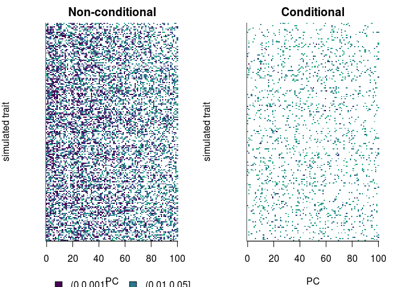
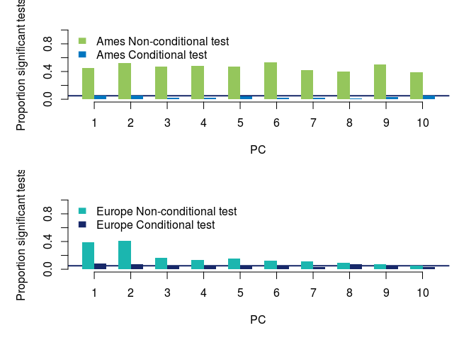
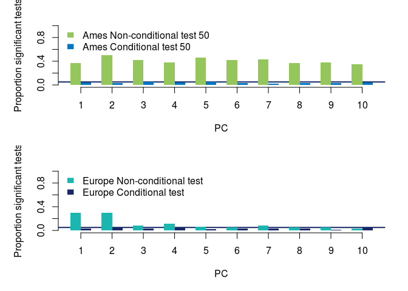

## Doing GWAS
### Ames

```r
#as before, only run this once
#the bimbam file is too big to share on github, but I will share the GWAS results
cutoff=0.1
doGwas <- function(myI, cutoff=0.1){
  set.seed(myI)
  
  #read in file and pull out 'significant hits'
  gemma.out = processGemmaOutput(paste('data/simFiles/gemmaout.',myI,'.assoc.txt',sep=""))
  sigs = dplyr::filter(gemma.out, p_lrt < cutoff)
  
  #LD prune
  linkm = read.table('data/FileS3.csv', header=T) 
  
  #make ranges basked on LD distance
  myranges = sapply(1:10, function(j){
    mychr = dplyr::filter(linkm, chromosome==j)
    windowStarts <- mychr[seq(1, nrow(mychr), 5),]
    windowEnds <- mychr[c(seq(1, nrow(mychr)-5, 5)+5,nrow(mychr) ),]
    mywin = IRanges(start=windowStarts$position, end=windowEnds$position)
    return(mywin)})
  ldwindows = GRanges()
  for (k in 1:10){
    chrld = GRanges(k, strand = "+",myranges[[k]])
    suppressWarnings(ldwindows <- append(ldwindows,chrld))
  }
  sig.ranges = GRanges(seqname = sigs$chr, ranges = IRanges(start=sigs$ps, width=1))
  myOverlaps = as.matrix(findOverlaps(ldwindows,sig.ranges))
  sigs$myIndex = as.numeric(row.names(sigs))
  myTop = dplyr::inner_join(as.data.frame(myOverlaps), sigs, by = c("subjectHits" = "myIndex")) %>% group_by(queryHits) %>% filter(p_lrt == min(p_lrt)) %>% sample_n(1) #pull out ones with lowest pvalues
  top.nodup = myTop[!duplicated(myTop$rs),]#remove duplicates
  write.table(top.nodup$rs, file=paste('data/simFiles/ldfiltered.',myI, sep=""),quote=FALSE, row.names=FALSE, col.names=FALSE)
  write.table(top.nodup, file=paste('data/simFiles/ldfiltered.assoc.',myI, sep=""),quote=FALSE, row.names=FALSE, col.names=FALSE)
  return(top.nodup)
}

mytest = sapply(1:200, doGwas)
```


Then pull out the hits from the larger dataset

```r
getSigSnps <- function(myI, sitePrefix = 'data/simFiles/ldfiltered.'){
  gwasSites = read.table(paste(sitePrefix,myI,sep=""), stringsAsFactors=F)
  system(paste('head -n 1 data/ames.281.june14.geno95.maf01.randomimpute > data/simFiles/sigSnps.ames.',myI,sep=""))
  #sapply(gwasSites$V1, function(x) {system(paste('grep ',x,' data/ames.281.june14.geno95.maf01.randomimpute >> data/simFiles/sigSnps.ames.',myI, sep=""))})
 sapply(gwasSites$V1, function(x) {system(paste('awk \'$3 == ', '"', x, '"' ,'\' data/ames.281.june14.geno95.maf01.randomimpute >> data/simFiles/sigSnps.ames.',myI, sep=""))})

  }

sapply(1:200, getSigSnps)
```

How many of simulated loci end up signficant in the GWAS analysis? How many of GWAS hits are false positive? how accurate are the effect size estimates?

```r
myI = 5

gwasStats <- function(myI, gwasPrefix = '../polygenic-maize/data/simFiles/gemmaout.', causalN = 500, pcutoff = 0.005){
#read in the GWAS hits
gemma.out = processGemmaOutput(paste(gwasPrefix,myI,'.assoc.txt',sep=""))
sig.sites = dplyr::filter(gemma.out, p_lrt < pcutoff)

#read in the sim sites
causal.sites = read.table(paste('data/simFiles/causalSites.', myI, sep=""), header=T, stringsAsFactors = F, nrow = causalN)

#how many of the sig ones overlap?
overlap.sites = dplyr::inner_join(sig.sites, causal.sites, by=c('rs'='locus'))
true.pos = nrow(overlap.sites)
false.pos = nrow(sig.sites) - nrow(overlap.sites)
false.neg = nrow(causal.sites) - true.pos
true.neg = nrow(gemma.out) - true.pos - false.pos - false.neg

#how correlated are simulate effect sizes with real effect sizes?
set.seed(myI)
beetas = matrix(rnorm(500), ncol=1, nrow=500) #simulate effect sizes
causal.beeta = data.frame(rs = causal.sites$locus, beeta = beetas, stringsAsFactors = F)

effect.compare = dplyr::left_join(causal.beeta, gemma.out, by = 'rs')
mycor = cor.test(effect.compare$beeta, effect.compare$beta)

return(c(true.pos, false.pos, true.neg, false.neg, mycor$estimate, mycor$p.value))}

myGwasStats = sapply(1:200, gwasStats)
myGwasStats50 = sapply(1:200, function(x){gwasStats(x, gwasPrefix = '../polygenic-maize/data/simFiles/gemmaout50.', causalN = 50)})
myGwasStats50bonf = sapply(1:200, function(x){gwasStats(x, gwasPrefix = '../polygenic-maize/data/simFiles/gemmaout50.', causalN = 50, pcutoff =  2.5e-07/400000)})

save(myGwasStats, file = 'data/gwasstats_ames.rda')
save(myGwasStats50, file = 'data/gwasstats50_ames.rda')
save(myGwasStats50bonf, file = 'data/gwasstats50bonf_ames.rda')
```

Look at the sims

```r
load('data/gwasstats_ames.rda')
load('data/gwasstats50_ames.rda')
load('data/gwasstats50bonf_ames.rda')
gwasStatsdf = data.frame(t(myGwasStats))
names(gwasStatsdf) = c('truepos','falsepos','trueneg','falseneg','cor','pval')
summary(gwasStatsdf)
```

```
##     truepos         falsepos         trueneg          falseneg    
##  Min.   : 5.00   Min.   : 700.0   Min.   :171765   Min.   :478.0  
##  1st Qu.:11.00   1st Qu.: 865.0   1st Qu.:171990   1st Qu.:484.0  
##  Median :13.00   Median : 920.0   Median :172048   Median :487.0  
##  Mean   :13.19   Mean   : 920.3   Mean   :172048   Mean   :486.8  
##  3rd Qu.:16.00   3rd Qu.: 977.5   3rd Qu.:172103   3rd Qu.:489.0  
##  Max.   :22.00   Max.   :1203.0   Max.   :172268   Max.   :495.0  
##       cor              pval          
##  Min.   :0.3764   Min.   :0.000e+00  
##  1st Qu.:0.4497   1st Qu.:0.000e+00  
##  Median :0.4700   Median :0.000e+00  
##  Mean   :0.4672   Mean   :5.280e-20  
##  3rd Qu.:0.4862   3rd Qu.:0.000e+00  
##  Max.   :0.5608   Max.   :9.731e-18
```

```r
gwasStatsdf50 = data.frame(t(myGwasStats50))
names(gwasStatsdf50) = c('truepos','falsepos','trueneg','falseneg','cor','pval')
summary(gwasStatsdf50)
```

```
##     truepos         falsepos        trueneg          falseneg    
##  Min.   : 6.00   Min.   :555.0   Min.   :112539   Min.   :33.00  
##  1st Qu.:10.00   1st Qu.:643.5   1st Qu.:112806   1st Qu.:37.00  
##  Median :12.00   Median :679.0   Median :112857   Median :38.00  
##  Mean   :11.93   Mean   :687.3   Mean   :112849   Mean   :38.07  
##  3rd Qu.:13.00   3rd Qu.:730.0   3rd Qu.:112892   3rd Qu.:40.00  
##  Max.   :17.00   Max.   :997.0   Max.   :112981   Max.   :44.00  
##       cor                  pval         
##  Min.   :-0.1215852   Min.   :0.002541  
##  1st Qu.:-0.0350856   1st Qu.:0.258105  
##  Median :-0.0055259   Median :0.476080  
##  Mean   :-0.0009911   Mean   :0.487871  
##  3rd Qu.: 0.0311217   3rd Qu.:0.759826  
##  Max.   : 0.1360693   Max.   :0.978455
```

```r
gwasStatsdf50bonf = data.frame(t(myGwasStats50bonf))
names(gwasStatsdf50bonf) = c('truepos','falsepos','trueneg','falseneg','cor','pval')
summary(gwasStatsdf50bonf)
```

```
##     truepos        falsepos        trueneg          falseneg    
##  Min.   :0.00   Min.   : 0.00   Min.   :113507   Min.   :48.00  
##  1st Qu.:0.00   1st Qu.: 0.00   1st Qu.:113536   1st Qu.:49.00  
##  Median :0.50   Median : 0.00   Median :113536   Median :49.50  
##  Mean   :0.56   Mean   : 0.76   Mean   :113535   Mean   :49.44  
##  3rd Qu.:1.00   3rd Qu.: 0.00   3rd Qu.:113536   3rd Qu.:50.00  
##  Max.   :2.00   Max.   :29.00   Max.   :113536   Max.   :50.00  
##       cor                  pval         
##  Min.   :-0.1215852   Min.   :0.002541  
##  1st Qu.:-0.0350856   1st Qu.:0.258105  
##  Median :-0.0055259   Median :0.476080  
##  Mean   :-0.0009911   Mean   :0.487871  
##  3rd Qu.: 0.0311217   3rd Qu.:0.759826  
##  Max.   : 0.1360693   Max.   :0.978455
```

```r
summary(gwasStatsdf50bonf$truepos + gwasStatsdf50bonf$falsepos)
```

```
##    Min. 1st Qu.  Median    Mean 3rd Qu.    Max. 
##    0.00    0.00    1.00    1.32    1.00   30.00
```

### European lines
And on the European sims


```r
cutoff=0.1
doGwas <- function(myI){
  set.seed(myI)
  
  system(paste("~/Apps/GEMMA/bin/gemma -bfile data/chip263 -k data/chip263.sXX.txt -n ",
                myI,
                "  -lmm 4 -miss 0.1 -k -o gemmaout.euro.",
                myI,
                sep=""))
}

system("mv output/* data/simFiles/")
  

pruneGwas <- function(myI, cutoff=0.1){
   
  #read in file and pull out 'significant hits'
  #filter out significant hits with awk???
  gemma.out = read.table(paste('data/simFiles/gemmaout.euro.',myI,'.assoc.txt',sep=""), header=T)
  sigs = dplyr::filter(gemma.out, p_lrt < cutoff)
  
  #LD prune
  linkm = read.table('data/FileS3.csv', header=T) 
  
  #make ranges basked on LD distance
  myranges = sapply(1:10, function(j){
    mychr = dplyr::filter(linkm, chromosome==j)
    windowStarts <- mychr[seq(1, nrow(mychr), 5),]
    windowEnds <- mychr[c(seq(1, nrow(mychr)-5, 5)+5,nrow(mychr) ),]
    mywin = IRanges(start=windowStarts$position, end=windowEnds$position)
    return(mywin)})
  ldwindows = GRanges()
  for (k in 1:10){
    chrld = GRanges(k, strand = "+",myranges[[k]])
    suppressWarnings(ldwindows <- append(ldwindows,chrld))
  }
  sig.ranges = GRanges(seqname = sigs$chr, ranges = IRanges(start=sigs$ps, width=1))
  myOverlaps = as.matrix(findOverlaps(ldwindows,sig.ranges))
  sigs$myIndex = as.numeric(row.names(sigs))
  myTop = dplyr::inner_join(as.data.frame(myOverlaps), sigs, by = c("subjectHits" = "myIndex")) %>% group_by(queryHits) %>% filter(p_lrt == min(p_lrt)) %>% sample_n(1) #pull out ones with lowest pvalues
  top.nodup = myTop[!duplicated(myTop$rs),]#remove duplicates
  #write.table(top.nodup$rs, file=paste('data/simFiles/ldfiltered.euro.',myI, sep=""),quote=FALSE, row.names=FALSE, col.names=FALSE)
  write.table(top.nodup, file=paste('data/simFiles/ldfiltered.euro.assoc.',myI, sep=""),quote=FALSE, row.names=FALSE, col.names=FALSE)
  #return(top.nodup)
}

#sapply(1:1000, doGwas)

sapply(1:200, pruneGwas)
sapply(201:1000, pruneGwas)


#pull out significant snps -- do this on Farm actually
getSigSnpsEuro <- function(myI, sitePrefix = 'data/simFiles/ldfiltered.euro.assoc.'){
  gwasSites = read.table(paste(sitePrefix,myI,sep=""), stringsAsFactors=F)
  system(paste('head -n 1 data/merged263Landraces.alleles.gmri.randomimpute > data/simFiles/sigSnps.euro.',myI,sep=""))
  gwasSiteNames = sapply(gwasSites$V4, function(x){paste('s',gsub(":","_",x),sep="")})
  #sapply(gwasSites$V1, function(x) {system(paste('grep ',x,' data/ames.281.june14.geno95.maf01.randomimpute >> data/simFiles/sigSnps.ames.',myI, sep=""))})
 sapply(gwasSiteNames, function(x) {system(paste('awk \'$3 == ', '"', x, '"' ,'\' data/merged263Landraces.alleles.gmri.randomimpute >> data/simFiles/sigSnps.euro.',myI, sep=""))})

  }

sapply(1:200, getSigSnpsEuro)
sapply(201:1000, getSigSnpsEuro)

#system("rsync -avz -e 'ssh -p 2022' farm:/home/emjo/euro-maize/data/simFiles/sigSnps* simFiles/")
```


How many of simulated loci end up signficant in the GWAS analysis? How many of GWAS hits are false positive? how accurate are the effect size estimates?

```r
myI = 5

gwasStatsEuro <- function(myI, gwasPrefix = '../polygenic-maize/data/simFiles/gemmaout.euro.', causalN=500, pcutoff = 0.005){
#read in the GWAS hits
gemma.out = read.table(paste(gwasPrefix,myI,'.assoc.txt',sep=""), header=T, stringsAsFactors = F)
gemma.out$locus = sapply(gemma.out$rs, function(x){paste('s',strsplit(x, ':')[[1]][1],'_',strsplit(x,':')[[1]][2], sep='')})
sig.sites = dplyr::filter(gemma.out, p_lrt < pcutoff)

#read in the sim sites
causal.sites = read.table(paste('data/simFiles/causalSites.euro.', myI, sep=""), header=T, stringsAsFactors = F, nrow=causalN)
# 
#how many of the sig ones overlap?
overlap.sites = dplyr::inner_join(sig.sites, causal.sites, by='locus')
true.pos = nrow(overlap.sites)
false.pos = nrow(sig.sites) - nrow(overlap.sites)
false.neg = nrow(causal.sites) - true.pos
true.neg = nrow(gemma.out) - true.pos - false.pos - false.neg

#how correlated are simulate effect sizes with real effect sizes?
set.seed(myI)
beetas = matrix(rnorm(500), ncol=1, nrow=500) #simulate effect sizes
causal.beeta = data.frame(locus = causal.sites$locus, beeta = beetas, stringsAsFactors = F)

effect.compare = dplyr::left_join(causal.beeta, gemma.out, by = 'locus')
mycor = cor.test(effect.compare$beeta, effect.compare$beta)

return(c(true.pos, false.pos, true.neg, false.neg, mycor$estimate, mycor$p.value))}

myGwasStatsEuro = sapply(1:200, gwasStatsEuro)
myGwasStatsEuro50 = sapply(1:200, function(x){gwasStatsEuro(x, gwasPrefix = '../polygenic-maize/data/simFiles/gemmaout50.euro.', causalN = 50)})
myGwasStatsEuro50bonf = sapply(1:200, function(x){gwasStatsEuro(x, gwasPrefix = '../polygenic-maize/data/simFiles/gemmaout50.euro.', causalN = 50, pcutoff =  2.5e-07/400000)})

save(myGwasStatsEuro, file = 'data/gwasstats_euro.rda')
save(myGwasStatsEuro50, file = 'data/gwasstats_euro50.rda')
save(myGwasStatsEuro50bonf, file = 'data/gwasstats_euro50bonf.rda')
```

Look at the sims

```r
load('data/gwasstats_euro.rda')
gwasStatsdf = data.frame(t(myGwasStatsEuro))
names(gwasStatsdf) = c('truepos','falsepos','trueneg','falseneg','cor','pval')
summary(gwasStatsdf)
```

```
##     truepos          falsepos       trueneg          falseneg    
##  Min.   : 3.000   Min.   :1893   Min.   :417362   Min.   :480.0  
##  1st Qu.: 7.750   1st Qu.:2179   1st Qu.:418732   1st Qu.:489.0  
##  Median : 9.000   Median :2262   Median :418804   Median :491.0  
##  Mean   : 9.315   Mean   :2273   Mean   :418793   Mean   :490.7  
##  3rd Qu.:11.000   3rd Qu.:2334   3rd Qu.:418887   3rd Qu.:492.2  
##  Max.   :20.000   Max.   :3704   Max.   :419173   Max.   :497.0  
##       cor               pval          
##  Min.   :0.07046   Min.   :0.000e+00  
##  1st Qu.:0.20816   1st Qu.:1.000e-08  
##  Median :0.24754   Median :4.200e-07  
##  Mean   :0.24638   Mean   :2.021e-03  
##  3rd Qu.:0.28543   3rd Qu.:2.584e-05  
##  Max.   :0.40151   Max.   :1.524e-01
```

```r
load('data/gwasstats_euro50.rda')
gwasStatsdf50 = data.frame(t(myGwasStatsEuro50))
names(gwasStatsdf50) = c('truepos','falsepos','trueneg','falseneg','cor','pval')
summary(gwasStatsdf50)
```

```
##     truepos          falsepos       trueneg          falseneg    
##  Min.   : 1.000   Min.   :1024   Min.   :210974   Min.   :39.00  
##  1st Qu.: 4.000   1st Qu.:1144   1st Qu.:211401   1st Qu.:44.00  
##  Median : 5.000   Median :1192   Median :211482   Median :45.00  
##  Mean   : 4.835   Mean   :1224   Mean   :211450   Mean   :45.16  
##  3rd Qu.: 6.000   3rd Qu.:1273   3rd Qu.:211530   3rd Qu.:46.00  
##  Max.   :11.000   Max.   :1700   Max.   :211650   Max.   :49.00  
##       cor                 pval       
##  Min.   :-0.207632   Min.   :0.0132  
##  1st Qu.:-0.050116   1st Qu.:0.2684  
##  Median :-0.002090   Median :0.5059  
##  Mean   :-0.004003   Mean   :0.4964  
##  3rd Qu.: 0.039597   3rd Qu.:0.7124  
##  Max.   : 0.189812   Max.   :1.0000
```

```r
load('data/gwasstats_euro50bonf.rda')
gwasStatsdf50bonf = data.frame(t(myGwasStatsEuro50bonf))
names(gwasStatsdf50bonf) = c('truepos','falsepos','trueneg','falseneg','cor','pval')
summary(gwasStatsdf50bonf)
```

```
##     truepos        falsepos         trueneg          falseneg    
##  Min.   :0.00   Min.   : 0.000   Min.   :212629   Min.   :49.00  
##  1st Qu.:0.00   1st Qu.: 0.000   1st Qu.:212674   1st Qu.:50.00  
##  Median :0.00   Median : 0.000   Median :212674   Median :50.00  
##  Mean   :0.14   Mean   : 0.565   Mean   :212673   Mean   :49.86  
##  3rd Qu.:0.00   3rd Qu.: 0.000   3rd Qu.:212674   3rd Qu.:50.00  
##  Max.   :1.00   Max.   :45.000   Max.   :212674   Max.   :50.00  
##       cor                 pval       
##  Min.   :-0.207632   Min.   :0.0132  
##  1st Qu.:-0.050116   1st Qu.:0.2684  
##  Median :-0.002090   Median :0.5059  
##  Mean   :-0.004003   Mean   :0.4964  
##  3rd Qu.: 0.039597   3rd Qu.:0.7124  
##  Max.   : 0.189812   Max.   :1.0000
```

```r
summary(gwasStatsdf50bonf$truepos + gwasStatsdf50bonf$falsepos)
```

```
##    Min. 1st Qu.  Median    Mean 3rd Qu.    Max. 
##   0.000   0.000   0.000   0.705   0.000  45.000
```


## Non-conditional test 
### Ames


```r
#do the nonconditional test using the same function used in real data (in Qpc-ames.md)
load('data/amesOnly.eig.rda')

ncamesOut = lapply(1:200, function(x){
  Qpcames_nocond(myI = x, gwasPrefix = 'data/simFiles/ldfiltered.assoc.', sigPrefix = 'data/simFiles/sigSnps.ames.', mypcmax = 100,
    myU = amesEig$vectors, myLambda = amesEig$values
  )})
save(ncamesOut, file='data/simFiles/qxpc_nonconditional_ames_200')  
```

### European lines


```r
#do noncoditional test using the same function used for the test on real data (in Qpc-euro.md)

load('data/euroOnlyK.rda')

nceuroOut <- lapply(1:200, function(x){
  Qpceuro_nocond(myI=x, gwasPrefix = 'data/simFiles/ldfiltered.euro.assoc.', sigPrefix = 'data/simFiles/sigSnps.euro.', mypcmax=100,
                 myU = euroOnlyeigen$vectors, myLambdas = euroOnlyeigen$values
                 )})

save(nceuroOut, file='data/simFiles/qxpc_nonconditional_euro_200') 
```

## Conditional test
### Ames


```r
## load data
load("data/ames.281E.K.rda")
load('data/ames.281E.condeig.rda')
ames281=myF
sigma11 = as.matrix(ames281[1:2704,1:2704])
sigma12 = as.matrix(ames281[1:2704,2705:2984])
sigma21 = as.matrix(ames281[2705:2984,1:2704])
sigma22 = as.matrix(ames281[2705:2984,2705:2984]) #we are dropping the last row
sigma.cond = sigma11 - sigma12 %*% solve(sigma22) %*% sigma21 

#run the test with same function used for real data (in Qpc-ames.md)
camesOut = lapply(1:200,function(x) {Qpcames(myI = x, gwasPrefix = 'data/simFiles/ldfiltered.assoc.', sigPrefix = 'data/simFiles/sigSnps.ames.', mypcmax = 100,
        myLambda = condEig$values, myU = condEig$vectors)})
save(camesOut, file='data/simFiles/qpc_ames_200')
```


```r
###load data
load('data/euro.282.E.rda')

myM=906
euro282 = myF
sigma11 = as.matrix(euro282[1:myM,1:myM])
sigma12 = as.matrix(euro282[1:myM,(myM+1):ncol(euro282)])
sigma21 = as.matrix(euro282[(myM+1):ncol(euro282),1:myM])
sigma22 = as.matrix(euro282[(myM+1):ncol(euro282),(myM+1):ncol(euro282)]) #we are dropping the last row
sigma.cond = sigma11 - sigma12 %*% solve(sigma22) %*% sigma21 
condEig = eigen(sigma.cond)


ceuroOut = lapply(1:200, function(x){
  Qpceuro(myI = x, gwasPrefix = 'data/simFiles/ldfiltered.euro.assoc.', sigPrefix = 'data/simFiles/sigSnps.euro.', mysigma = euro282, mypcmax = 100,
          myLambda = condEig$values, myU = condEig$vectors)
  })
save(ceuroOut, file='data/simFiles/qpc_euro_200') 
```


## Look at the results


```r
### 500 SNPs
load('data/simFiles/qxpc_nonconditional_ames_200') #ncamesOut
load('data/simFiles/qxpc_nonconditional_euro_200') #nceuroOut
load('data/simFiles/qpc_euro_200') #ceuroOut
load('data/simFiles/qpc_ames_200') #camesOut

####compare nc and c for ames and euro (with inflation factor)
nap = sapply(ncamesOut, function(x) {x$pprime}) #matrix, rows are pvals, columns are traits
cap = sapply(camesOut, function(x) {x$pprime}) #matrix, rows are pvals, columns are traits
nep = sapply(nceuroOut, function(x) {x$pprime}) #matrix, rows are pvals, columns are traits
cep = sapply(ceuroOut, function(x) {x$pprime}) #matrix, rows are pvals, columns are traits

###heatmaps
par(mar=c(4,4,2,2), xpd=TRUE, mfrow=c(1,1), mfrow=c(1,2))
mysig2 =  cut((1:1000/1000), c(0,0.001,0.01,0.05,0.1,1)) #for legend
mycol = c(viridis(6, direction=1)[1:4], "white")
image(nap, col=mycol, xaxt="n", yaxt="n", bty="l", breaks=c(0,0.001,0.01,0.05,0.1,1), ylab = "simulated trait", xlab="PC", main="Non-conditional")
legend(0,-0.15, levels(mysig2), fill=mycol, bty="n", ncol=3)
axis(1, at = c(0,0.2,0.4,0.6,0.8,1), labels=round(c(0,0.2,0.4,0.6,0.8,1)*nrow(nap)))
image(cap, col=mycol, xaxt="n", yaxt="n", bty="l", breaks=c(0,0.001,0.01,0.05,0.1,1), ylab = "simulated trait", xlab = "PC", main="Conditional")
axis(1, at = c(0,0.2,0.4,0.6,0.8,1), labels=round(c(0,0.2,0.4,0.6,0.8,1)*nrow(cap)))
```

<!-- -->

```r
image(nep, col=mycol, xaxt="n", yaxt="n", bty="l", breaks=c(0,0.001,0.01,0.05,0.1,1), ylab = "simulated trait", xlab="PC", main="Non-conditional")
legend(0,-0.15, levels(mysig2), fill=mycol, bty="n", ncol=3)
axis(1, at = c(0,0.2,0.4,0.6,0.8,1), labels=round(c(0,0.2,0.4,0.6,0.8,1)*99+1))
image(cep[,1:200], col=mycol, xaxt="n", yaxt="n", bty="l", breaks=c(0,0.001,0.01,0.05,0.1,1), ylab = "simulated trait", xlab = "PC", main="Conditional")
axis(1, at = c(0,0.2,0.4,0.6,0.8,1), labels=round(c(0,0.2,0.4,0.6,0.8,1)*99+1))
```

<!-- -->

```r
### bar plots of the proportion of sims that have p < 0.05
par(xpd=F, mfrow = c(2,1), mar=c(5,5,2,2))
mycol = lacroix_palette('Lime')

#get proportion of ps that are below (just first 10 PCs)
prop05 <- function(pvals){apply(pvals, 1, function(x){sum(x< 0.05)/length(x)})}

plot(-1,-1, ylim = c(0,1), xlim = c(1,30), bty="n", xlab = "PC", ylab = "Proportion significant tests", xaxt="n", yaxt = "n")
abline(h=0.05, col = mycol[6], lwd=2)
test = barplot(rbind(prop05(nap)[1:10], prop05(cap)[1:10]), beside=T, border=NA, col = mycol[c(2,5)], ylim=c(0,1), add=T)
axis(1, at = test[1,]+ 0.5, lab = 1:10, cex=1.5)
legend('topleft', c('Ames Non-conditional test', 'Ames Conditional test'), fill = mycol[c(2,5)], border="white", bty="n")
## show affect of inflation factor (compared to genic Va test), for supps

plot(-1,-1, ylim = c(0,1), xlim = c(1,30), bty="n", xlab = "PC", ylab = "Proportion significant tests", xaxt="n", yaxt = "n")
abline(h=0.05, col = mycol[6], lwd=2)
test = barplot(rbind(prop05(nep)[1:10], prop05(cep)[1:10]), beside=T, border=NA, col = mycol[c(4,6)], ylim=c(0,1), add=T)
axis(1, at = test[1,]+ 0.5, lab = 1:10, cex=1.5)
legend('topleft', c('Europe Non-conditional test', 'Europe Conditional test'), fill = mycol[c(4,6)], border="white", bty="n")
```

<!-- -->

```r
### 50 SNPs
load('data/simFiles/qxpc_nc_ames50_200.rda') #ncamesOut
load('data/simFiles/qxpc_nc_euro50_200.rda') #nceuroOut
load('data/simFiles/qxpc_euro50_200.rda') #ceuroOut
load('data/simFiles/qxpc_ames50_200.rda') #camesOut

nap50 = sapply(ncamesOut50, function(x) {x$pprime}) #matrix, rows are pvals, columns are traits
cap50 = sapply(qxpcames_sims50, function(x) {x$pprime}) #matrix, rows are pvals, columns are traits
nep50 = sapply(nceuroOut50, function(x) {x$pprime}) #matrix, rows are pvals, columns are traits
cep50 = sapply(euroOut50, function(x) {x$pprime}) #matrix, rows are pvals, columns are traits

plot(-1,-1, ylim = c(0,1), xlim = c(1,30), bty="n", xlab = "PC", ylab = "Proportion significant tests", xaxt="n", yaxt = "n")
abline(h=0.05, col = mycol[6], lwd=2)
test = barplot(rbind(prop05(nap50)[1:10], prop05(cap50)[1:10]), beside=T, border=NA, col = mycol[c(2,5)], ylim=c(0,1), add=T)
axis(1, at = test[1,]+ 0.5, lab = 1:10, cex=1.5)
legend('topleft', c('Ames Non-conditional test 50', 'Ames Conditional test 50'), fill = mycol[c(2,5)], border="white", bty="n")

plot(-1,-1, ylim = c(0,1), xlim = c(1,30), bty="n", xlab = "PC", ylab = "Proportion significant tests", xaxt="n", yaxt = "n")
abline(h=0.05, col = mycol[6], lwd=2)
test = barplot(rbind(prop05(nep50)[1:10], prop05(cep50)[1:10]), beside=T, border=NA, col = mycol[c(4,6)], ylim=c(0,1), add=T)
axis(1, at = test[1,]+ 0.5, lab = 1:10, cex=1.5)
legend('topleft', c('Europe Non-conditional test', 'Europe Conditional test'), fill = mycol[c(4,6)], border="white", bty="n")
```

<!-- -->

