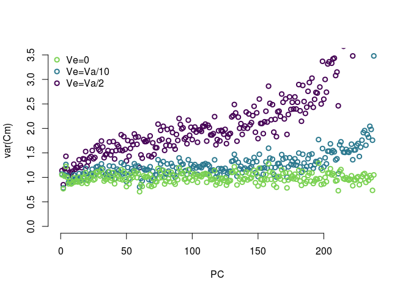
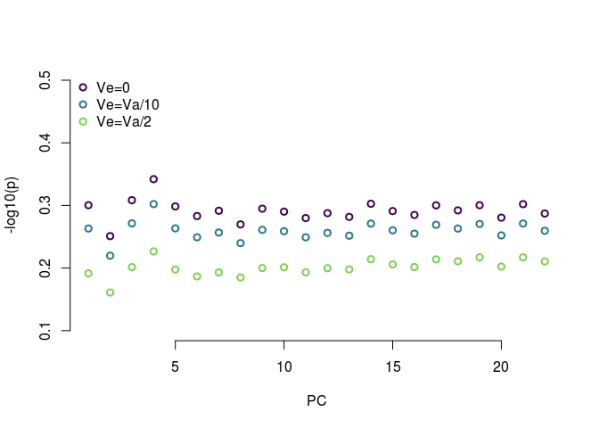
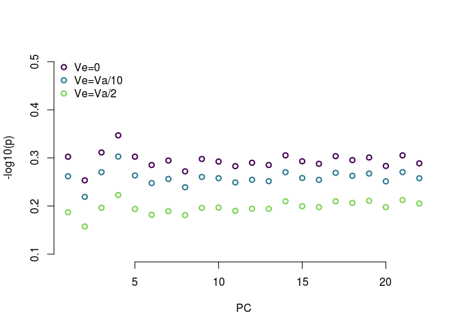
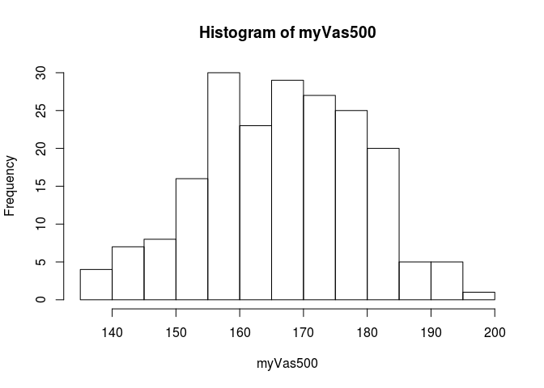

This notebook has code for running simulations for Q<sub>pc</sub> analysis in a GWAS panel of 240 maize lines and Q<sub>xpc</sub> on Ames and European lines.


###Q<sub>pc</sub> simulations:


```r
#read in kinship data
myK = read.table('data/All_240E.nomaf.nomissing.K')
myKnames = read.table('data/240.names', stringsAsFactors = F)$V1 #get individual names
row.names(myK) = myKnames[1:dim(myK)[1]]

#eigendecomposition of the kinship matrix
eigF = eigen(myK)
myU = eigF$vectors
myLambdas = eigF$values

#get test cutoffs
varexp = myLambdas/sum(myLambdas)
sumexp = sapply(1:length(varexp), function(x){sum(varexp[1:x])})
pcmax = which(sumexp > 0.3)[1]
tailCutoff = round(.9*length(myLambdas))
```


```r
#simulate traits with neutrality and varying amounts of Va. Run this once and save output to save time.
neutQpc <- function(myK,myU,myLambdas, myseed=1,myVa=1, myVe=0){
set.seed(myseed)
myZneutral = mvrnorm(n=1, rep(0,dim(myK)[1]), myVa*myK + myVe*diag(dim(myK)[1])) #neutral traits
myQpcneutral = calcQpc(myZneutral, myU, myLambdas)
return(myQpcneutral)
}
neutQpcVe0 = lapply(1:200, function(x){neutQpc(myK, myU, myLambdas, myseed=x, myVa=1, myVe=0)})#no Ve
neutQpcVe.1 = lapply(1:200, function(x){neutQpc(myK, myU, myLambdas, myseed=x,myVa=1, myVe=.1)}) #Ve = Va/10
neutQpcVe.5 = lapply(1:200, function(x){neutQpc(myK, myU, myLambdas, myseed=x,myVa=1, myVe=.5)}) #Ve = Va/2

save(neutQpcVe0,neutQpcVe.1,neutQpcVe.5, tailCutoff, pcmax, file="data/simFiles/Qpc200.rda")
```

We can measure false positives using the variance of C values (which we expect to be Va under neutrality, which has been set as 1 here)

```r
load('data/simFiles/Qpc200.rda')
mycol = viridis(6)

#no Ve
allCms = sapply(neutQpcVe0, function(x) {x$cm}) #matrix where columns are the Cm values for a given simulation (from PC1 to PC 239)
allCmVars = apply(allCms, 1, var0) #get variance across all 200 sims for each pc
plot(allCmVars[1:tailCutoff], bty="n", col = mycol[1], lwd=2, xlab = 'PC', ylab = "var(Cm) with no Ve", xlim = c(0,tailCutoff))
```

<!-- -->

```r
allPs = sapply(neutQpcVe0, function(x) {x$pvals}) #matrix where columns are the Cm values for a given simulation (from PC1 to PC 239)

count_sig = sapply(1:pcmax, function(x){sum(allPs[x,]<=0.05)})
```

Without any V<sub>e</sub>, the variance of C<sub>m<sub> is centered around 1, as expected under neutrality. What happpens when we add V<sub>e</sub>?


```r
#adding Ve
allCmsVe.1 = sapply(neutQpcVe.1, function(x) {x$cm})
allCmVarsVe.1 = apply(allCmsVe.1, 1, var0) #get variance across all 200 sims for each pc
allCmsVe.5 = sapply(neutQpcVe.5, function(x) {x$cm})
allCmVarsVe.5 = apply(allCmsVe.5, 1, var0) #get variance across all 200 sims for each pc

plot(allCmVarsVe.5[1:tailCutoff], bty="n", col = mycol[1], lwd=2, xlab = 'PC', ylab = "var(Cm)", xlim = c(0, tailCutoff), ylim=c(0,3.5))
points(allCmVarsVe.1[1:tailCutoff], col = mycol[3], lwd=2)
points(allCmVars[1:tailCutoff], col = mycol[5], lwd=2)
legend('topleft', c('Ve=0','Ve=Va/10','Ve=Va/2'), col = mycol[c(5,3,1)], pch=1, bty="n", pt.lwd=2)
```

<!-- -->

Adding V<sub>e</sub> increases the variance of Cm at increasingly large scales. This will make our test conservative. We can see how conservative but calculating the average P value across tests. 


```r
#testing for selection on early PCs
allPs = sapply(neutQpcVe0, function(x){x$pvals})
meanPs = apply(allPs, 1, mean)
allPsVe.1 = sapply(neutQpcVe.1, function(x){x$pvals})
meanPsVe.1 = apply(allPsVe.1, 1, mean)
allPsVe.5 = sapply(neutQpcVe.5, function(x){x$pvals})
meanPsVe.5 = apply(allPsVe.5, 1, mean)

plot(-log10(meanPs), col = mycol[1], bty="n", xlab = "PC", ylab = "-log10(p)", ylim=c(0.1,0.5), lwd=2)
points(-log10(meanPsVe.1), col=mycol[3], lwd=2)
points(-log10(meanPsVe.5), col=mycol[5], lwd=2)
legend('topleft', c('Ve=0','Ve=Va/10','Ve=Va/2'), col = mycol[c(1,3,5)], pch=1, bty="n", pt.lwd=2)
```

<!-- -->

Doing simulations where we incorporate actual loci


```r
## simulate allele frequencies in each of 240 pops. nloci = 1050, 50 of these are used to make the trait, the rest to estimate K

mysims = sapply(1:200, function(i){
set.seed(i)
nloci = 10050
ancPop = runif(nloci, min=0, max=1) #ancestral allele frequenices
presentPops1 = sapply(ancPop, function(x){mvrnorm(n=1, mu = rep(x,239), x*(1-x)*myK)})
presentPops = apply(presentPops1, c(1,2), myBound) #deal with numbers greater or less than 0 (the outer bounds are sticky)
popGenos = sapply(1:239, function(x) getPopGenos(x, presentPops, 1)) # matrix where each row is a SNP and each column is an individual
myG = t(popGenos[51:10050,])/2#snps used to make K matrix
myKsim = make_k_E(myG) #make a new pop matrix
myEigsim = eigen(myKsim)
#plot(1:239,myEigsim$values[1:239])
beetas = matrix(c(rnorm(50), rep(0, 10000)), ncol=1, nrow=nloci) 
popPhenos = apply(popGenos, 2, function(x){x %*% beetas})
myQpcneutral = calcQpc(popPhenos, myEigsim$vectors, myEigsim$values)
#plot(myEigsim$vectors[,1], popPhenos, bty="n", xlab = "PC1", ylab ="Sim phenos"
return(list(phenos = popPhenos, kSim = myKsim, myCms = myQpcneutral$cm))
})

save(mysims, file = "data/simFiles/qpc_loci_sims.rda")
```


Look at the simulations

```r
mycol = lacroix_palette('Mango')
load('data/simFiles/qpc_loci_sims.rda')
#mysims is a matrix, each column is a sim. first row is phenotypes (in 1 item list), second row is a one item list with the kinship matrix in it, third row is a list of the cm values. 
#what do CM values look like across PCs
myCms = sapply(1:200, function(x){mysims[3,x][[1]]}) #rows are PCs, cols are simulations
myCmMeans = sapply(1:238, function(x){mean(myCms[x,]^2)})

#what is Va going to be??
myVas = sapply(1:200, function(x){calcVa(runif(50, min=0, max=1), rnorm(50))})
hist(myVas)
```

<!-- -->

```r
## so Cm~N(0,2Va), so cm^2 ~ 2Va

plot(-100,-100, xlim = c(0,240), ylim = c(0,max(myCms)^2), bty="n", xlab = "PC", ylab = "Cm^2")
test = sapply(1:200, function(x){points(1:238,myCms[,x]^2, col = mycol[3])})
abline(v = 0.9*239, lwd=2)
points(1:238,myCmMeans, col = mycol[6], pch=16)
```

<!-- -->

```r
plot(1:238, myCmMeans, bty="n", xlab = "PC", ylab = "CM^2 means")
myl = lm(myCmMeans ~ c(1:238))
abline(myl, col = mycol[2], lwd=3)
abline(h = mean(myVas)*2, lwd=3, col = mycol[4])
```

<!-- -->

```r
summary(myl)
```

```
## 
## Call:
## lm(formula = myCmMeans ~ c(1:238))
## 
## Residuals:
##      Min       1Q   Median       3Q      Max 
## -13.7510  -2.8893   0.0642   2.5992  10.2340 
## 
## Coefficients:
##              Estimate Std. Error t value Pr(>|t|)    
## (Intercept) 32.394724   0.533909   60.67   <2e-16 ***
## c(1:238)     0.051151   0.003873   13.21   <2e-16 ***
## ---
## Signif. codes:  0 '***' 0.001 '**' 0.01 '*' 0.05 '.' 0.1 ' ' 1
## 
## Residual standard error: 4.105 on 236 degrees of freedom
## Multiple R-squared:  0.4249,	Adjusted R-squared:  0.4225 
## F-statistic: 174.4 on 1 and 236 DF,  p-value: < 2.2e-16
```

```r
#how often are we detecting selection using our standard parameters
#myps = sapply(1:200, function(x){mySims[3,x][[1]]})
#plot(-100,-100, xlim = c(0,40), ylim=c(0, -log10(min(unlist(myps)))*1.1), bty="n", xlab = "PC", ylab = "-log10 p")
#test = lapply(myps, function(x){points(-log10(x))})
```


